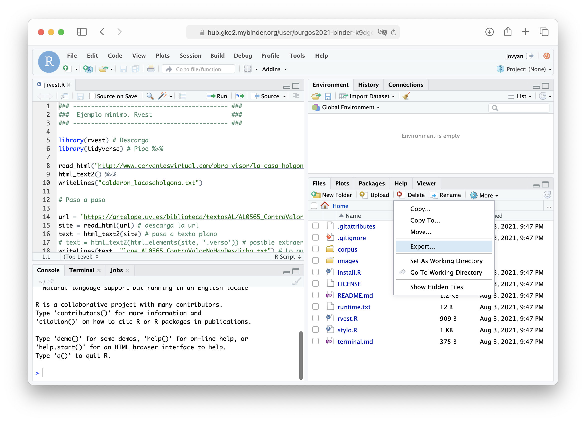

# Rstudio en línea

Haga clic en el icono _launch binder_ para cargar este repositorio, `burgos2021/binder`, en una instancia en línea de RStudio: 

Binder es un servicio que permite crear entornos computacionales reproducibles a partir de repositorios en github. En este caso, una instancia de Rstudio (en linux) con los paquetes `rvest`, `stylo`, `tidyverse` precargados, así como con algunos ejemplos mínimos del uso de esos paquetes.

La instancias en binder son útiles para reproducir código en un entorno cerrado y precargado, sin preocuparse de instalaciones locales o de diferentes sistemas operativos. Varios usuarios (hasta 100) pueden interacturar con el entorno para probar, modificar, etc.

La memoria en el servidor es limitada (no permite grandes operaciaciones). Binder se detiene después de 10 minutos de inactividad.

Es posible añadir archivos a los ya precargados desde el repositorio (y descargarlos) en la versión de Rstudio en Binder. Se puede para ello usar en el menú las funciones de cargar (_Upload_) o exportar (_more > Export_).

